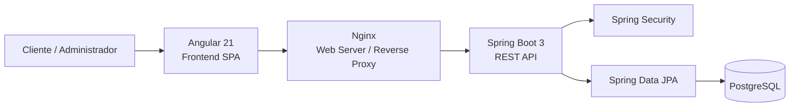
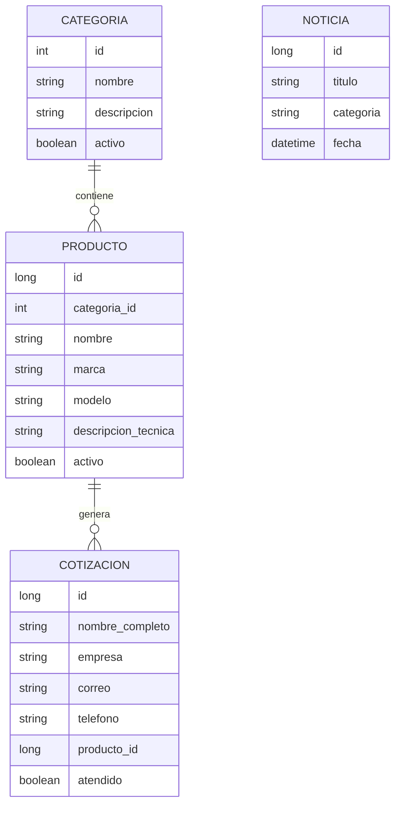
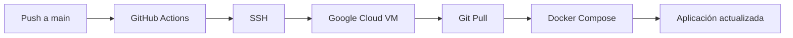

# 🌍 TEKTONICA

> Plataforma Full Stack para gestión y presentación de soluciones geoespaciales, equipos topográficos y contenido técnico.

TEKTONICA es un proyecto académico desarrollado como una solución web integral para una empresa especializada en tecnologías geoespaciales, topografía, geodesia, fotogrametría y equipamiento técnico.

La plataforma combina un **sitio web corporativo**, un **catálogo dinámico de equipos**, un sistema de **solicitudes de cotización**, un módulo de **noticias técnicas** y un **panel administrativo** para la gestión del contenido.

La solución está construida con **Angular y Spring Boot**, utiliza **PostgreSQL** para persistencia, expone una **API REST documentada con OpenAPI/Swagger** y puede ejecutarse completamente mediante **Docker Compose**.

Además, el repositorio incorpora un flujo de despliegue automatizado mediante **GitHub Actions hacia Google Cloud Platform**.

---

# 🚀 Funcionalidades principales

## 🌐 Sitio público

La aplicación dispone de diferentes secciones orientadas a clientes y visitantes:

- Landing page corporativa.
- Información institucional.
- Catálogo técnico de productos.
- Filtrado de equipos por categoría.
- Detalle de soluciones geoespaciales.
- Formulario de contacto.
- Solicitudes de cotización.
- Sección de novedades y artículos técnicos.
- Detalle individual de noticias.
- Política de privacidad.
- Términos de servicio.

---

## 🛰️ Catálogo técnico

TEKTONICA incorpora un catálogo especializado para equipos y soluciones de:

- GNSS.
- Estaciones totales y óptica.
- Escáner láser.
- Drones.
- Software geoespacial.

Cada producto puede almacenar información como:

- Nombre.
- Marca.
- Modelo.
- Categoría.
- Descripción técnica.
- Imagen.
- Especificaciones.
- Estado activo/inactivo.

El catálogo público muestra únicamente los equipos habilitados.

---

# 📋 Sistema de cotizaciones

Los visitantes pueden enviar solicitudes de información o cotización desde el sitio web.

El backend registra información como:

```text
Nombre
Empresa
Correo electrónico
Teléfono
Producto relacionado
Mensaje
Fecha
Estado de atención
```

Las solicitudes son persistidas en PostgreSQL y pueden utilizarse posteriormente como **leads comerciales**.

---

# 📰 Módulo de noticias

La plataforma cuenta con un módulo de publicaciones para contenido técnico y corporativo.

Las noticias pueden incluir:

- Título.
- Contenido.
- Categoría.
- Imagen.
- Subtítulo.
- Video embebido.
- Datos técnicos destacados.
- Fecha de publicación.

Los artículos se muestran públicamente mientras su administración queda restringida al entorno de gestión.

---

# 🛠️ Panel administrativo

TEKTONICA incorpora un backoffice protegido para administrar el contenido principal del sistema.

Desde el panel es posible gestionar:

### Equipos

- Crear productos.
- Editar información técnica.
- Consultar el inventario completo.
- Activar o desactivar equipos.
- Asignar categorías.
- Gestionar imágenes y especificaciones.

### Noticias

- Crear publicaciones.
- Editar artículos existentes.
- Consultar noticias.
- Eliminar publicaciones.

El catálogo utiliza **borrado lógico** para los productos, permitiendo retirar un equipo del sitio público sin eliminarlo físicamente de la base de datos.

---

# 🏗️ Arquitectura



El frontend consume una API REST desarrollada con Spring Boot.

En producción, **Nginx** sirve la aplicación Angular y actúa como reverse proxy hacia el backend.

---

# 💻 Stack tecnológico

## Frontend

- Angular 21
- TypeScript 5.9
- RxJS
- Angular Router
- Angular Forms
- HTML5
- CSS

## Backend

- Java 17
- Spring Boot 3.2
- Spring Web
- Spring Data JPA
- Spring Security
- Jakarta Validation
- Lombok
- Springdoc OpenAPI

## Base de datos

- PostgreSQL 15
- JPA / Hibernate
- SQL

## Infraestructura

- Docker
- Docker Compose
- Nginx
- Google Cloud Platform
- GitHub Actions

---

# 🔐 Seguridad

El backend utiliza **Spring Security** para diferenciar los recursos públicos de las operaciones administrativas.

Las operaciones públicas incluyen:

```text
GET  /categorias
GET  /productos
GET  /productos/categoria/{id}
GET  /noticias
GET  /noticias/{id}
POST /cotizaciones
```

Las operaciones administrativas requieren autenticación:

```text
POST   /productos
PUT    /productos/{id}
PATCH  /productos/{id}/toggle-status
DELETE /productos/{id}

POST   /noticias
PUT    /noticias/{id}
DELETE /noticias/{id}
```

La versión académica actual implementa autenticación HTTP Basic para el panel administrativo.

> En un entorno productivo se recomienda sustituir este mecanismo por autenticación basada en JWT/OAuth y credenciales administradas mediante variables de entorno o un servicio de secretos.

---

# 📡 API REST

La API utiliza el prefijo:

```text
/api/v1
```

Entre sus principales recursos se encuentran:

```text
/api/v1/productos
/api/v1/categorias
/api/v1/cotizaciones
/api/v1/noticias
```

La API incorpora documentación mediante **OpenAPI / Swagger UI** para facilitar la exploración y prueba de endpoints.

---

# 🗄️ Modelo de datos

La solución utiliza PostgreSQL con entidades principales como:

```text
Categoria
Producto
Cotizacion
Noticia
```

Relaciones principales:



---

# 🐳 Docker

El proyecto puede ejecutarse de forma completa utilizando Docker Compose.

La infraestructura contiene tres servicios principales:

```text
PostgreSQL
Spring Boot API
Angular + Nginx
```

## Requisitos

- Docker
- Docker Compose
- Git

## 1. Clonar el proyecto

```bash
git clone https://github.com/MtrXisback/TEKTONICA.git
cd TEKTONICA
```

## 2. Crear archivo de entorno

Linux / macOS:

```bash
cp .env.example .env
```

Windows:

```powershell
copy .env.example .env
```

## 3. Configurar variables

Edita:

```text
.env
```

Ejemplo:

```env
DB_NAME=proyectogeo_db
DB_USER=geo_admin
DB_PASSWORD=coloca_una_contrasena_segura
DB_PORT_OUT=5432
```

> No publiques contraseñas reales ni archivos `.env` en el repositorio.

## 4. Construir y ejecutar

```bash
docker compose up -d --build
```

## 5. Consultar servicios

```bash
docker compose ps
```

## 6. Detener el entorno

```bash
docker compose down
```

---

# 📂 Estructura del proyecto

```text
TEKTONICA/
│
├── front/
│   ├── src/
│   │   └── app/
│   │       ├── config/
│   │       ├── guards/
│   │       ├── models/
│   │       ├── pages/
│   │       └── services/
│   └── Dockerfile
│
├── back/
│   ├── src/
│   │   └── main/
│   │       ├── java/com/proyectogeo/
│   │       │   ├── config/
│   │       │   ├── controller/
│   │       │   ├── dto/
│   │       │   ├── model/
│   │       │   ├── repository/
│   │       │   └── service/
│   │       │
│   │       └── resources/
│   └── Dockerfile
│
├── .github/
│   └── workflows/
│       └── deploy.yml
│
├── docker-compose.yml
├── .env.example
└── .gitignore
```

---

# ⚙️ CI/CD

El repositorio incorpora un workflow de **GitHub Actions** que ejecuta el despliegue automáticamente cuando se realizan cambios sobre la rama:

```text
main
```

Flujo:



Las credenciales del servidor se gestionan mediante **GitHub Secrets**.

Durante el despliegue se ejecuta:

```bash
git pull origin main
docker-compose down
docker-compose up --build -d
docker image prune -f
```

---

# 🎯 Objetivos técnicos

TEKTONICA fue desarrollado para aplicar conceptos de:

- Desarrollo Full Stack.
- Angular + Spring Boot.
- Diseño de APIs REST.
- Arquitectura por capas.
- Persistencia con JPA.
- PostgreSQL.
- Autorización con Spring Security.
- Gestión de catálogos.
- Captura de leads.
- Backoffice administrativo.
- Dockerización.
- Reverse Proxy con Nginx.
- CI/CD.
- Despliegue en Google Cloud.
- Documentación de APIs con OpenAPI.

---

# 🔮 Posibles mejoras

Entre las futuras mejoras del proyecto se podrían incorporar:

- Autenticación JWT u OAuth.
- Gestión de usuarios administrativos desde base de datos.
- Roles y permisos configurables.
- Panel para gestión de cotizaciones.
- Envío automático de correos.
- Almacenamiento Cloud de imágenes.
- Paginación y búsqueda avanzada.
- Tests unitarios e integración.
- Monitoreo y observabilidad.
- HTTPS automatizado.
- Mejora del pipeline CI/CD.

---

# 🎓 Contexto

Proyecto académico desarrollado como parte de la formación en **Computación e Informática**.

El objetivo fue construir una plataforma empresarial Full Stack que combinara presencia corporativa, gestión de contenido, catálogo técnico, captación de potenciales clientes y administración interna utilizando tecnologías modernas de desarrollo web.

---

# 👨‍💻 Autor

**Miguel Alonso Villon Alcantara**

Desarrollador Full Stack Jr.

- GitHub: [@MtrXisback](https://github.com/MtrXisback)
